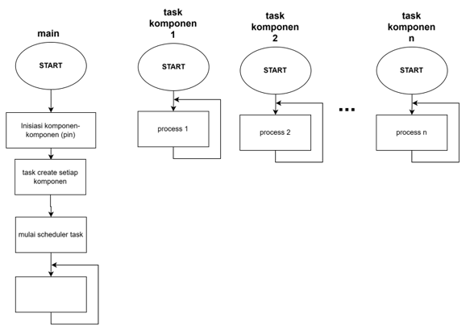
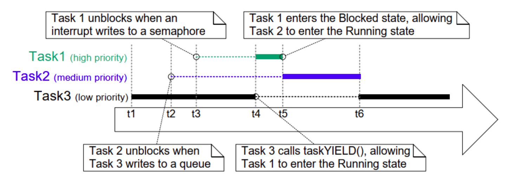
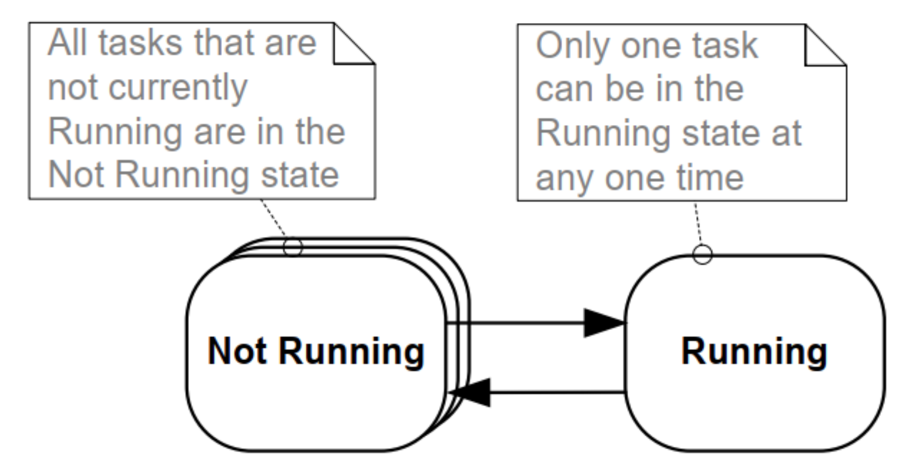
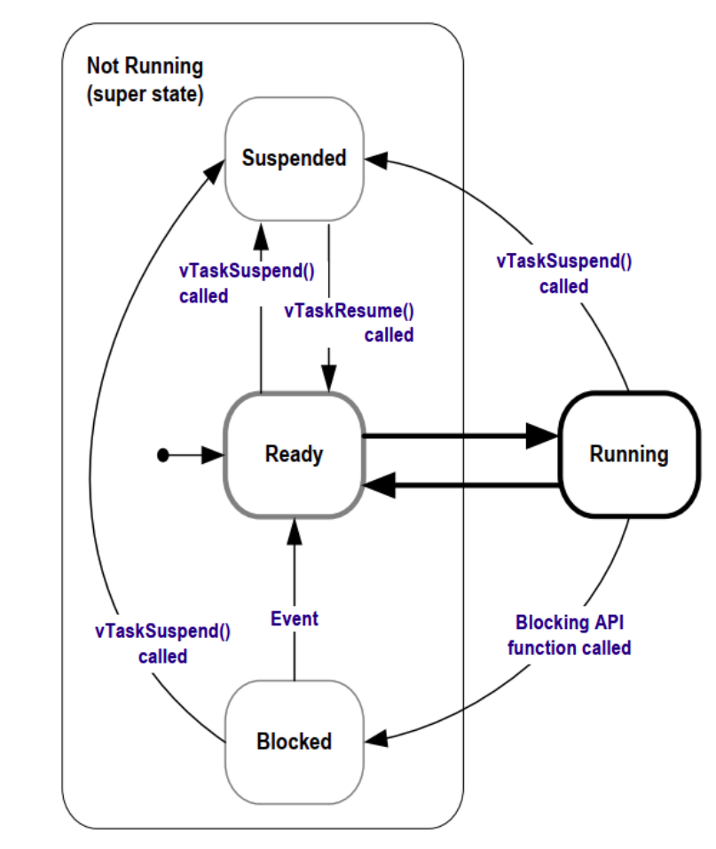
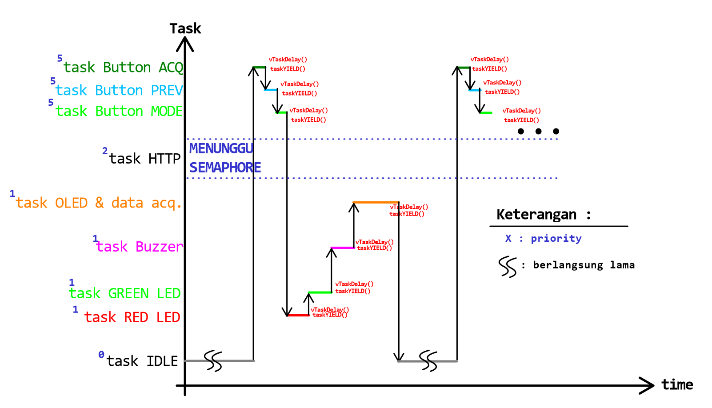
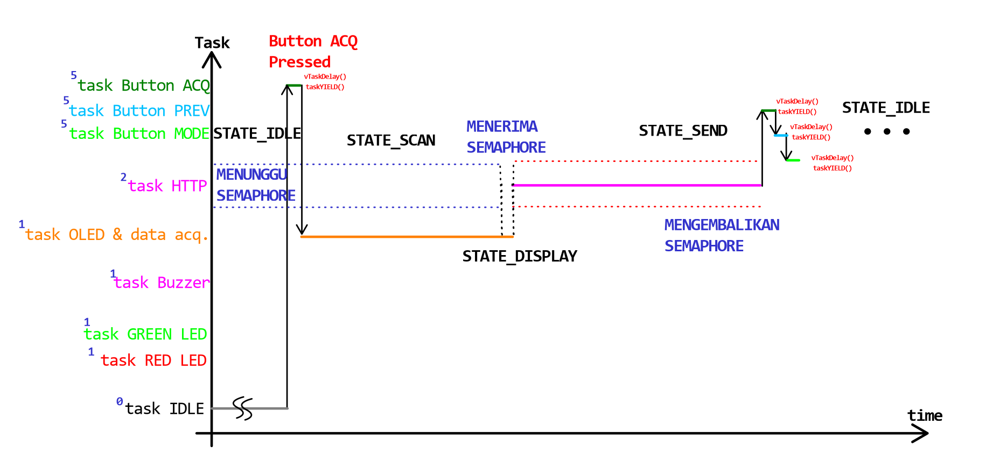

# Inventrix&copy; Warehouse Management System Hardware

## Deskripsi

Kode terintegrasi untuk sub-sistem hardware warehouse management system scanner : RFID & Bracode.

Kode aplikasi ini menggabungkan kerja berbagai komponen dalam beberapa task yang berjalan secara bersamaan dengan menggunakan penjadwalan _FreeRTOS_.



Berikut adalah struktur file dari aplikasi ini:


- `sd.h` : implementasi perilaku komponen SD card reader.
- `utils.h` : fungsi-fungsi tambahan seperti error handling, konversi array uint8_t menjadi string.
- ~`barcode.h` : implementasi perilaku komponen barcode scanner..~
- ~`rfid.h` : implementasi perilaku komponen rfid scanner.~
- `data_acquisition.h` : implementasi fungsi scanning dengan barcode / rfid scanner.
- `http_client.h` : implementasi fungsi untuk kirim data ke back-end
- `button.h` : implementasi button : acquire, previous, mode,
- `buzzer.h` : implementasi perilaku komponen buzzer.
- `led.h` : implementasi perilaku komponen led (merah, hijau).
- `oled.h` : implementasi perilaku komponen SSD1306 OLED display.
- `oled_img.h` : deklarasi gambar-gambar yang ditampilkan di OLED display.

## Desain Sistem

Secara umum, perangkat keras dari sistem ini memiliki 5 sub-sistem yaitu :

- **Sub-sistem `Data Acquisition` :**  membaca data yang ada di label produk (barcode) atau dari RFID tag kemudian meneruskan data tersebut ke sub-sistem `data processing` untuk diproses.

- **Sub-sistem `Data Processing` :**  Menerima data dari subsistem `data acquisition` berupa barcode ataupun RFID tag kemudian akan diolah untuk diteruskan ke sub-sistem `gateway` dan juga subsistem `display`.

- **Sub-sistem `Display` :** Menampilkan data barcode atau RFID tag yang telah diolah dari sub-sistem `data processing` pada OLED dan juga memberikan tanda ke _user_ melalui nyala LED dan bunyi buzzer.

- **Sub-sistem `Gateway` :** menerima data dari `data processing` untuk dikirimkan ke bagian **sistem informasi**.

- **Sub-sistem `Power` :** Memberikan tenaga pada sistem melalui baterai + charging module + buck-boost converter dan juga mengatur operasi _low power mode_.

Berikut adalah diagram blok dari sistem :

### Level 0


### Level 1


### Level 2


## Implementasi Sistem

Komponen dibuat dalam bentuk _task_ dengan operasi tiap-tiap _task_ ditentukan oleh _state machine_ yang disimpan dalam sebuah struct parameter task di bagian `taskParams.state`:

```C
typedef struct
{
    int state;
    uint8_t epc[len_epc];
} TaskParameters;

TaskParameters taskParams;
```

Data yang diperoleh dari hasil scanning yang kemudian akan ditampilkan ke sub-sistem display dan juga dikirimkan ke _backend_ disimpan dalam variabel global `taskParams.epc`.

Algoritma penjadwalan RTOS (_real time operating system_) yang digunakan adalah _Cooperative scheduling_ untuk memastikan bahwa keberlangsungan suatu task dapat berjalan sampai akhir satu siklus `for(;;)` terlebih dahulu lalu dilanjutkan oleh task lain. Hal ini krusial terutama untuk task _http_ yang harus sukses selama proses pengiriman dari menerima data sampai akhir kirim ke backend tanpa terinterupsi _task_ lain.



Implementasi _cooperative scheduling_ dibuat dengan menambahkan `taskYIELD()` pada akhir `for(;;)` setiap task.

Untuk memastikan taks `http_client` berjalan setelah data sukses dierima dari fungsi `data_acquisition` dan ditampilkan pada OLED (task `OLED`), maka digunakan mekanisme pemberian dan pengambilan **Semaphore** .

### Catatan Tambahan terkait Implementasi Sistem

1. Barcode scanner awalnya dibuat terus melakukan _scanning_ tetapi kemudian dibuat menjadi ter-trigger oleh  perintah UART `0x00 (50ms)` + `0x04, 0xE4, 0x04, 0x00, 0xFF, 0x14` dengan pertimbangan menghemat energi serta IC yang panas apabila terus menyala.

2. Barcode dan RFID awalnya dibuat dalam masing-masing **task** terpisah yang diimplementasikan di file terpisah `barcode.h` serta `rfid.h`. Namun setelah dipertimbangkan kembali, kedua komponen tersebut digabung menjadi sebuah **function** yang dipanggil yang diimplementasikan di `data_acquisition.h`. hal ini disebabkan kedua tipe scanner tidak akan berjalan secara bersama-sama.

### Penjadwalan RTOS

Mikrokontroller yang digunakan memiliki satu buah _core yang secara efektif dapat digunakan sehingga dalam satu waktu, hanya terdapat satu _task_ saja yang dapat berjalan.



Secara lebih lengkap, berikut adalah _state chart_ dari task yang ada :


Karena jenis penjadwalan yang digunakan adalah _cooperative scheduling_, maka kapan task berjalan ditentukan oleh kita. Dalam kasus ini, setiap task akan berjalan dalam satu siklus (satu kali iterasi `for(;;)`) lalul kemudian memberikan kesempatan pada task lain untuk berjalan (`taskYIELD()`). Berikut adalah _timing diagram_ RTOS dari program hardware ini:



`button ACQ` memiliki prioritas tertinggi maka akan dijalankan pertama kali. Ketika task `button ACQ`  melakukan `taskYIELD()`, maka yang melanjutkan adalah task dengan prioritas tinggi selanjutan yaitu `button PREV`. saat `taskYIELD()` berikutnya, dilanjut dnegan `button MODE`. Setelah itu, yang lanjut bukanlah `button ACQ` lagi karena masih berada pada _blocked state_ akibat pemanggilan `vTaskDelay()` di akhir satu siklusnya, namun task dengan priority yang lebih rendah yaitu task `OLED & data acquisition`, `task buzzer`, `task RED LED`, dan `task GREEN LED` secara bergantian dengan durasi berbeda-beda (tergantung durasi satu siklus masing-masing task). Pada kondisi ini, task _HTTP_ tidak berjalan karena masih menunggu `Event_Semaphore` dari task `OLED & data acquisition`. Semua task sedang berada dalam keadaan block karena terdapat `vTaskDelay()` di akhir masing-masing task sehingga terdapat kondisi _IDLE_ yang tercapai. Task pertama yang selesai di-_delay_ (keluar dari state _BLOCK_), maka akan dijalankan dan demikian seterusnya.

Saat salah satu button ditekan (misalkan button `ACQ`), maka akan terjadi hardware interrupt yang menyebabkan state berubah. Saat state berubah dari state _IDLE_ menuju state _SCAN_, maka yang berjalan adalah task OLED sampai menerima data dari Barcode scanner. Saat sudah menerima data, maka secara otomatis akan pindah ke state _DISPLAY_ untuk ditampilkan ke OLED lalu berpindah ke state _SEND_. Sebelum memasuki state _SEND_, maka semaphore akan diberikan dari task _OLED_ menuju task _HTTP_ sehingga yang berjalan adalah task _HTTP_.




## Related resources

**Resources**  | **Links**
-----------|----------------------------------
Hardware Abstraction Layer API References  | [HAL API Reference Infineon](https://infineon.github.io/psoc6hal/html/modules.html)
OLED Segger EmWin User Manual  | [OLED User Manual](https://www.segger.com/downloads/emwin)
FreeRTOS Documentation | [FreeRTOS Documentation](https://www.freertos.org/Documentation/RTOS_book.html)
PSoC6 Development kits | [CY8CPROTO-062-4343W](https://www.infineon.com/dgdl/Infineon-CY8CPROTO-062-4343W_PSoC_6_Wi-Fi_BT_Prototyping_Kit_Guide-UserManual-v01_00-EN.pdf?fileId=8ac78c8c7d0d8da4017d0f0118571844)
Desain PCB  |   [PCB](https://github.com/bostang/PCBs/tree/main/WMS)

## Document history

Document title: _Inventrix &copy;WMS hardware_

 **Version** | **Description of change**    | **Tanggal**
 ------- | ---------------------    | ----
 1.0.0   | Implementasi awal kode| 25 April 2024
 2.0.0   | Terintegrasi dari proses akuisisi data sampai kirim ke back-end (_single cycle_) | 9 Mei 2024
 3.0.0   | x    |-
 3.1.0   | x    |-
---------------------------------------------------------

## To-do

1. Pengembangan kode yang kontinu (FSM lengkap) (tidak hanya _single cycle_)
2. Pengembangan kode _low power_
3. Penyempurnaan kode RFID
4. Pengembangan kode RFID re-write tag
5. Data hasil RFID diubah dari _byte array_ ke format _readable_ (_high byte_ dan _low byte_ dipisahkan) (misal:  `0x03 0x05 0x24 0x16 0x45 0x15 0x3A`  menjadi `0305241645153A`)
6. Pengembangan kode SD card (set SSID & password Wifi, konten RFID tag untuk di-rewrite

### Extra notes
1. hapus baris `free(variabel_kirim);` pada `http_client.h` karena dia menyebabkan error dan task gagal.
2. Bug : buzzer kadang-kadang berdering sekali atau terus berdering (ekspektasi hanya dua kali). Ini kemungkinan masalah _scheduling_


Inventrix&copy;2024
