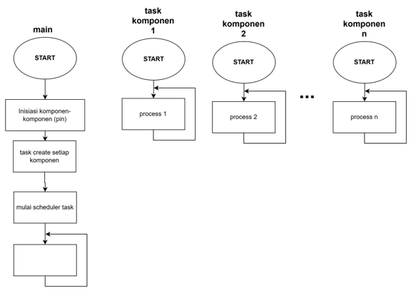
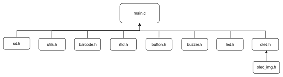
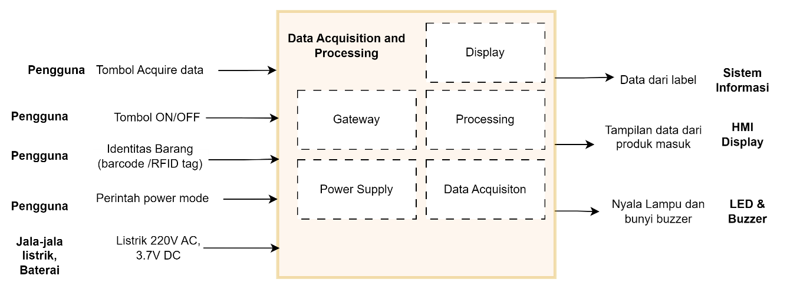
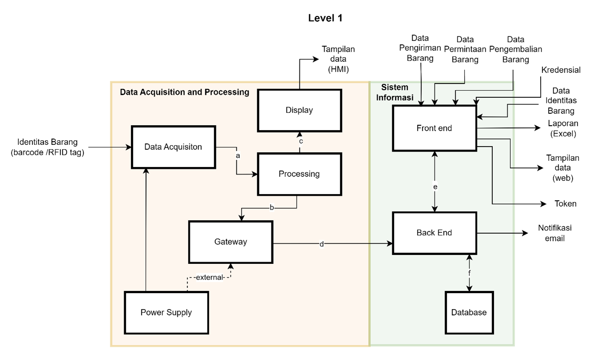
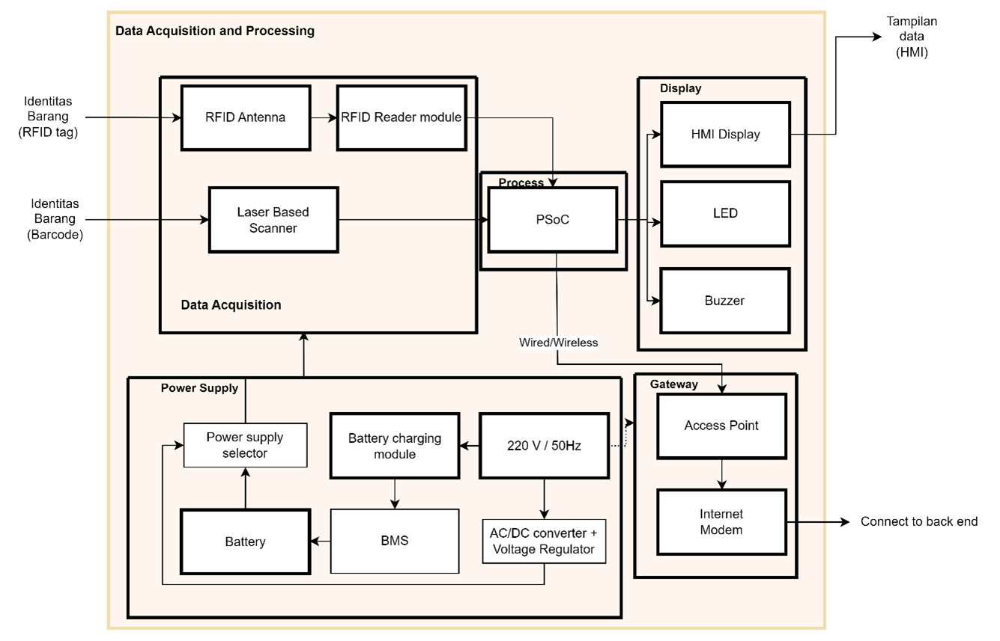

# Inventrix&copy; Warehouse Management System Hardware

## Deskripsi

Kode terintegrasi untuk sub-sistem hardware warehouse management system scanner : RFID & Bracode.

Kode aplikasi ini menggabungkan kerja berbagai komponen dalam beberapa task yang berjalan secara bersamaan dengan menggunakan penjadwalan _FreeRTOS_.

Berikut adalah struktur file dari aplikasi ini:

- `sd.h` : implementasi perilaku komponen SD card reader.
- `utils.h` : fungsi-fungsi tambahan seperti error handling, konversi array uint8_t menjadi string    
- `barcode.h` : implementasi perilaku komponen barcode scanner
- `rfid.h` : implementasi perilaku komponen rfid scanner
- `button.h` : implementasi button : acquire, previous, mode
- `buzzer.h` : implementasi perilaku komponen buzzer
- `led.h` : implementasi perilaku komponen led (merah, hijau)
- `oled.h` : implementasi perilaku komponen SSD1306 OLED display
- `oled_img.h` : deklarasi gambar-gambar yang ditampilkan di OLED display

## Desain Sistem

Secara umum, perangkat keras dari sistem ini memiliki 5 sub-sistem yaitu :
- **Sub-sistem `Data Acquisition` :**  membaca data yang ada di label produk (barcode) atau dari RFID tag kemudian meneruskan data tersebut ke sub-sistem `data processing` untuk diproses.

- **Sub-sistem `Data Processing` :**  Menerima data dari subsistem `data acquisition` berupa barcode ataupun RFID tag kemudian akan diolah untuk diteruskan ke sub-sistem `gateway` dan juga subsistem `display`.

- **Sub-sistem `Display` :** Menampilkan data barcode atau RFID tag yang telah diolah dari sub-sistem `data processing` pada OLED dan juga memberikan tanda ke _user_ melalui nyala LED dan bunyi buzzer.

- **Sub-sistem `Gateway` :** menerima data dari `data processing` untuk dikirimkan ke bagian **sistem informasi**.

- **Sub-sistem `Power` :** Memberikan tenaga pada sistem melalui baterai + charging module + buck-boost converter dan juga mengatur operasi _low power mode_.

Berikut adalah diagram blok dari sistem :

### Level 0

### Level 1

### Level 2

 
## Related resources

Resources  | Links
-----------|----------------------------------
Hardware Abstraction Layer API References  | [HAL API Reference Infineon](https://infineon.github.io/psoc6hal/html/modules.html)
OLED Segger EmWin User Manual  | [OLED User Manual](https://www.segger.com/downloads/emwin) 
FreeRTOS Documentation | [FreeRTOS Documentation](https://www.freertos.org/Documentation/RTOS_book.html)
PSoC6 Development kits | [CY8CPROTO-062-4343W](https://www.infineon.com/dgdl/Infineon-CY8CPROTO-062-4343W_PSoC_6_Wi-Fi_BT_Prototyping_Kit_Guide-UserManual-v01_00-EN.pdf?fileId=8ac78c8c7d0d8da4017d0f0118571844)

## Document history

Document title: *Inventrix &copy;WMS hardware*

 Version | Description of change
 ------- | ---------------------
 1.0.0   | Implementasi awal kode
 2.0.0   | x
 3.0.0   | x
 3.1.0   | x
 

---------------------------------------------------------
