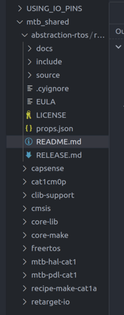
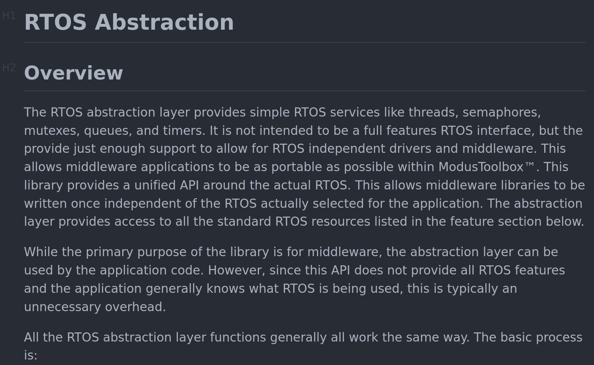

1. Untuk membantu mempelajari konsep pemrograman PSoC, kita bisa bisa juga membaca file-file yang ada yang secara otomatis terbentuk / di example






2. sedikit trick untuk convert size image : `

```
convert -resize 20% source.png dest.jpg
```

3. workflow yang lumayan efektif

ketika melihat dokumen-dokumen seperti user-manual, lebih enak diilihat di pdf viewer di VScode ketimbang di browser --> kebanyakan tab dan harus buka **My documents** dulu untuk ngebuka pdfnya.

4. Cara cepat untuk build sekaligus flash program ke PSoC

Pada direktori (_workspace_) yang dibuat, buka terminal lalu ketikkan:
```
make program
```
5. Dalam melakukan pengembangan kode, upayakan untuk menggunakan `MACRO`. Usahakan tidak ada angka pada tengah-tengah kode. Deklarasikan semua `MACRO` di awal.

6. Pengembangan kode dengan PSoC memiliki alur kembangkan dari _example_ yang ada, sesuaikan dengan kebutuhan kita berdasarkan referensi [HAL API](https://infineon.github.io/psoc6hal/html/index.html) dan gunakan bantuan [ChatGPT](chat.openai.com/chat) agar proses pengembangan lebih efektif dan mengurangi kebingunan.
